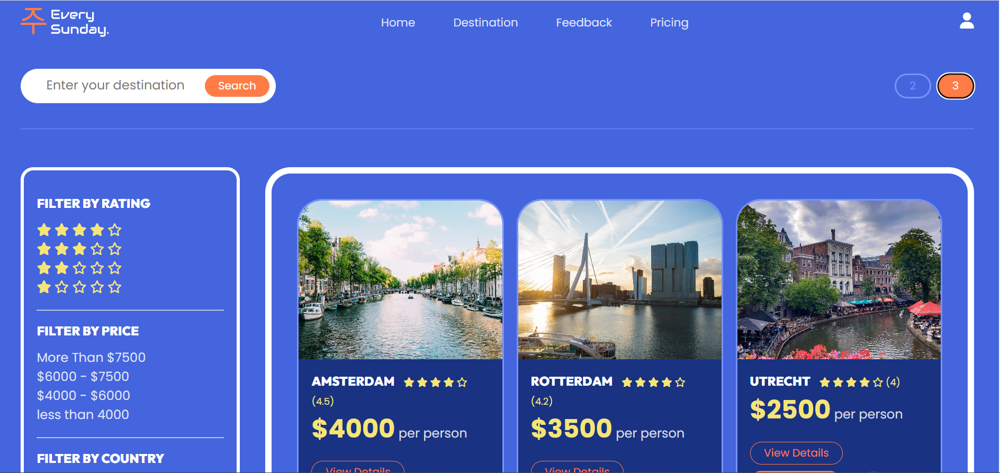

# Every Sunday ( Travel Agency Website )

Welcome to Cooperative Bridge 6636, a web application built using HTML, CSS, and JavaScript. This project aims to create a cooperative platform that bridges people together. Below, you will find information about the project, its frontend pages, backend server, and how to access the live version deployed on Netlify.

## Frontend Pages

1. **Home Page**
   The home page serves as the landing page for the Cooperative Bridge 6636 application. It provides an overview of the platform's purpose, features, and benefits.

   
   

2. **Destination Page**
   The destination page displays various destinations available within the cooperative network. Users can browse through different locations, view details, and find travel options.

   
   

3. **Pricing Page**
   The pricing page provides information about the different pricing plans available for users. It details the features and benefits of each plan and allows users to select the one that best suits their needs.

   

4. **Feedback Page**
   The feedback page allows users to share their thoughts, suggestions, and feedback about the platform. It provides a form for users to submit their feedback.

   

5. **Login Page**
   The login page is the entry point for registered users to access their accounts. Users can enter their credentials to log in and gain access to the platform's features.

   

6. **Admin Page**
   The admin page is a restricted area accessible only to authorized personnel. It provides administrative tools to manage user accounts, feedback, and other essential features.

   

## Tech Stacks

The frontend of Cooperative Bridge 6636 is built using the following technologies:

- **HTML**: The foundation of the web application, used for structuring the content and elements.

- **CSS**: Responsible for styling and presentation, making the application visually appealing.

- **JavaScript**: Adds interactivity and dynamic functionality to the web pages.

## Backend Server

The backend server provides the necessary data and functionality for the Cooperative Bridge 6636 application. It offers various endpoints to interact with the data.

**Server Link**: [https://mock-every-sunday-server.onrender.com](https://mock-every-sunday-server.onrender.com)

**Endpoints**:
1. `/users`: This endpoint allows interaction with user data, such as registration and authentication.

2. `/destinations`: Use this endpoint to fetch information about different destinations available within the cooperative network.

3. `/testimonials`: Interact with this endpoint to access and manage user feedback and testimonials.

## Deployment

The live version of Cooperative Bridge 6636 is deployed on Netlify. You can access the application through the following link:

**Netlify Link**: [https://sparkly-salamander-87a5f4.netlify.app/](https://sparkly-salamander-87a5f4.netlify.app/)

Feel free to explore the features of Cooperative Bridge 6636. If you encounter any issues or have any feedback, you can use the "Feedback" page to share your thoughts with us.

Thank you for using Cooperative Bridge 6636! We hope you have a wonderful experience using our platform. If you have any questions or need assistance, please don't hesitate to contact our support team.

Happy bridging! 🌉
